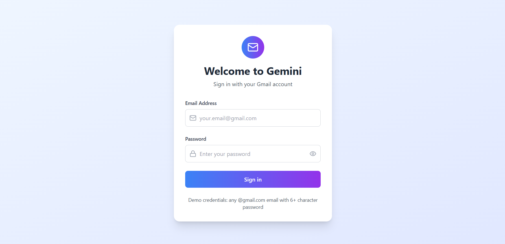
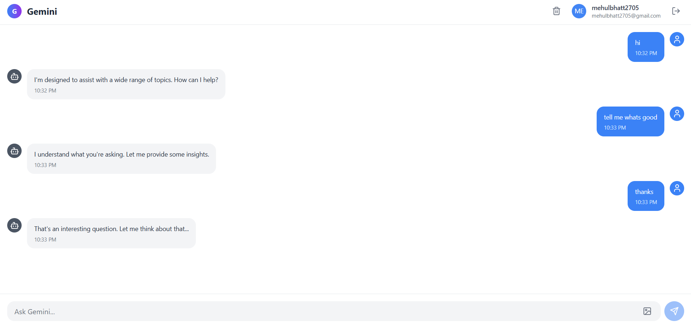

# Gemini Frontend Clone 💬✨

A modern, responsive, and accessible frontend clone of Google’s Gemini conversational AI, built using **Next.js 15**, **Tailwind CSS**, **Zustand**, and **React Hook Form**.  
This project fulfills the full assignment requirement — including OTP-based login, chatroom simulation, dark mode, modern UI patterns, accessibility, and local data storage.

---

📘 Project Overview
Gemini Frontend Clone is a conversational AI web interface inspired by Google's Gemini UI. It features OTP login, chatroom management, simulated AI messaging, and modern UI/UX best practices — all built with Next.js 15, Tailwind CSS, Zustand, and more.

🔗 Live link: https://lunakid270.netlify.app/

---

⚙️ Setup & Run Instructions

# 1. Clone the repository
git clone https://github.com/yourusername/gemini-frontend-clone.git
cd gemini-frontend-clone

# 2. Install dependencies
npm install

# 3. Start the development server
npm run dev

# 4. Visit
http://localhost:3000

---

🧠 Core Implementation Details
⏳ Throttling (AI Message Rate)
Custom throttle utility prevents multiple AI messages from flooding on rapid user inputs.

Controlled by a setTimeout to simulate natural typing delay.

🔁 Pagination & Infinite Scroll
Chat messages load newest-to-oldest (reverse scroll).

Older messages fetched on scroll-up trigger (simulated).

Stored client-side via Zustand for persistence.

🧩 Form Validation
React Hook Form for OTP and phone input handling

Zod for schema-based field validation with real-time error messages

Ensures user cannot submit invalid formats (e.g., empty OTP)

---

## 📌 Objective

To build a responsive, modular frontend for a conversational AI application that includes:

- OTP-based login/signup with country code selector
- Chatroom creation, deletion, and persistence
- AI message simulation with typing delay
- A beautiful, animated, responsive UI using Tailwind
- Full dark mode support, accessibility, and smooth UX

---

## 🚀 Features Breakdown

### 🔐 OTP Authentication
- OTP login simulation using `setTimeout`
- Country code selector fetched from `restcountries.com`
- Validated with **React Hook Form** + **Zod**
- Controlled form fields and client-side error handling

### 💬 Chatroom System
- Zustand-managed state for storing multiple chatrooms
- Create/delete chatrooms with confirmation toasts
- Throttled AI replies with simulated typing effect
- Infinite scroll-like UI for past messages (reverse scrolling)
- Auto-scroll to latest message on user send

### 📷 Chat UI Features
- Glassmorphism-based chat bubbles
- Image upload support via base64 preview (no backend)
- Copy-to-clipboard on hover
- Message timestamps and sender identification
- Typing indicator with `setTimeout` simulation

### 🌙 Global UX/UI
- Dark mode via `class` toggle (`useTheme` hook)
- Custom scrollbar, gradient backgrounds, blur layers
- Keyboard navigation (focus-visible outlines)
- Debounced search bar for filtering chatrooms
- LocalStorage persistence (chat, auth state)
- Loading skeletons & transition animations

---

## 🧰 Tech Stack

| Layer | Tools |
|-------|-------|
| **Framework** | Next.js 15 (App Router) |
| **Styling** | Tailwind CSS, glassmorphism, gradients |
| **State Management** | Zustand |
| **Form Handling** | React Hook Form + Zod |
| **Toasts** | react-hot-toast |
| **Image Upload** | Local preview URL |
| **Theme** | class-based dark mode |
| **Icons** | Lucide React |

---

## 📸 Screenshots

